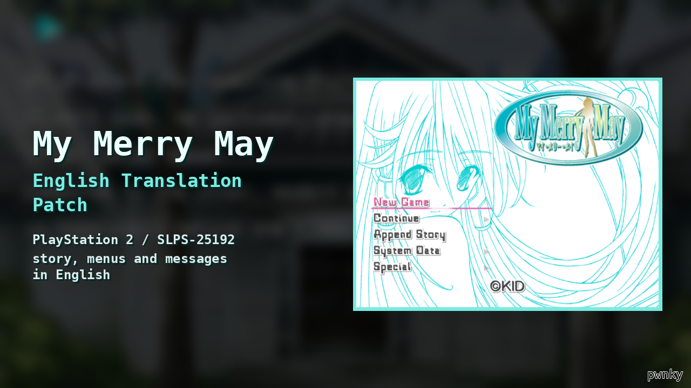
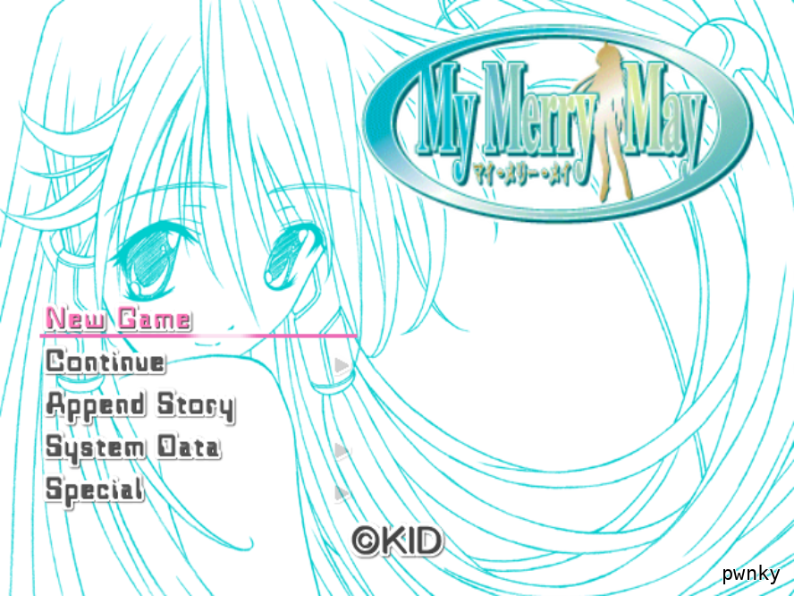
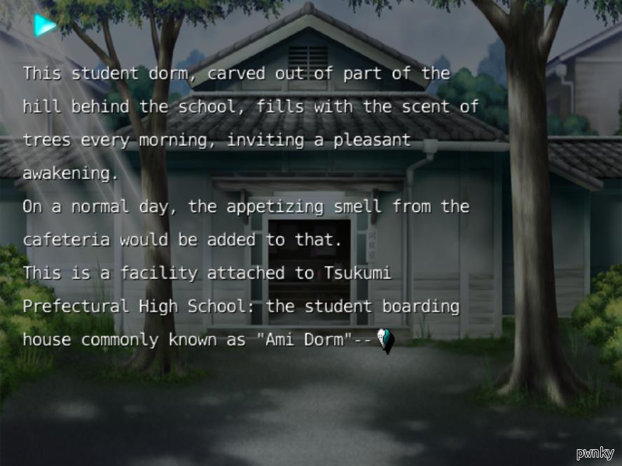
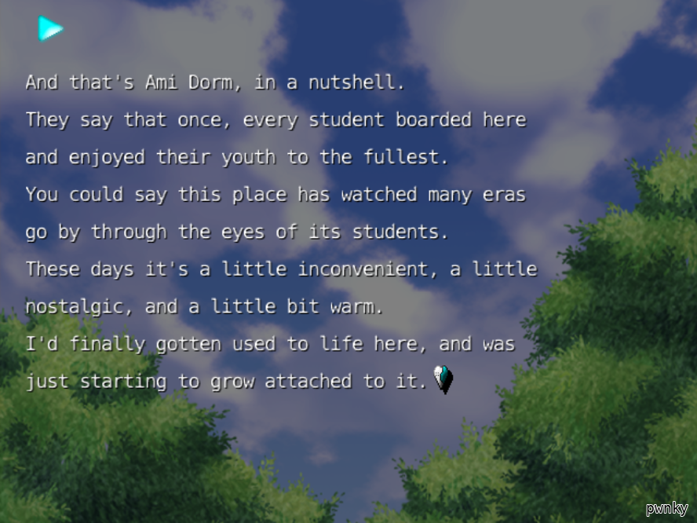
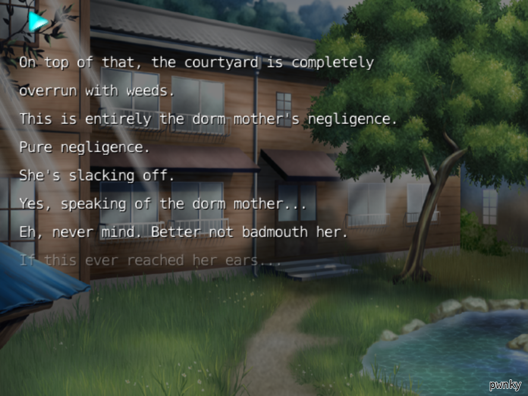

# My Merry May (PS2) – English Translation Patch

English fan translation of **My Merry May** (マイ・メリー・メイ), KID, PlayStation 2 (SLPS-25192).

*upload by pwnky*

## What's translated
- full story
- menus, save/load messages, options, chapter and scene titles
- smaller English font with proper punctuation

## Not translated / known issues
- staff credits (names and role headings) are still Japanese
- song lyrics are left as-is
- not play-tested end to end; layout issues in later scenes are possible

## Screenshots
| | |
|---|---|
|  |  |
|  |  |

## How to patch
You need **your own dump** of the original Japanese disc as an `.iso`:

| | |
|---|---|
| Size | 1738833920 bytes |
| CRC32 | `86616ECF` |
| SHA-1 | `2f3864821f2a88f86bb5e004f383d63add82bde2` |
| MD5 | `8bae301ad49c4cea125d08578b16a2a5` |

1. Open a BPS patcher such as [Floating IPS](https://github.com/Alcaro/Flips) or Multipatch.
2. Choose `MyMerryMay_EN.bps` and your original `.iso`.
3. Save the result as a new file (don't overwrite your original).
4. Expected SHA-1 of the result: `6d697508ce87240dc8ab6cb2bcc71944beeadc00`

## Playing
Tested in PCSX2. On a blank memory card the game shows a "system file is missing" message at boot; press ✕ to continue and save system data once from the System Data menu so it stops appearing.

This repository contains **no game data**, only a patch.
